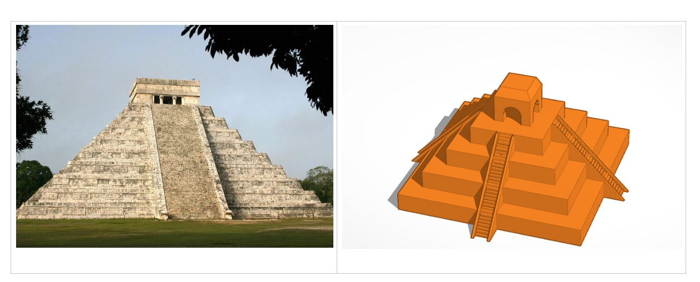
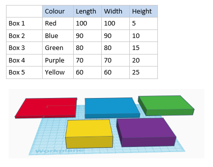
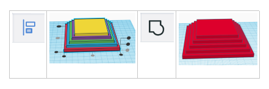
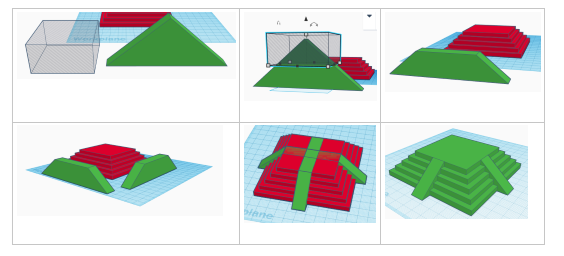

# Making a Mayan temple

## Step 1 – Create a New Design

	1. Click on your profile picture to go to your account 
	
	2. Click on the Blue button to create a new design
	
  	3. Rename your design at the top left to "Mayan Temple by ….." 
	

## Step 2 - Making the basic shape

	1. Start by making 5 boxes of the following sizes
	
	2. Select them all (hold Shift and click each box, or draw a box around them all) 
	
	3. Click on the align button and align centrally horizontally and vertically (see the grey circles below) group together. 
	

## Step 3  - Making the steps

	1. Create a roof shape that is 15mm in length, 120mm in width and 50mm in height.
	
	2. Create a hole box that is 80 x 40 (height 40mm).
	
	3. Raise the hole box 25mm above the workplane.
	
	4. Align and group to cut out the top.
	
	5. Duplicate the steps and rotate 90 degrees. 
	
	6. Align everything and group together.
	

