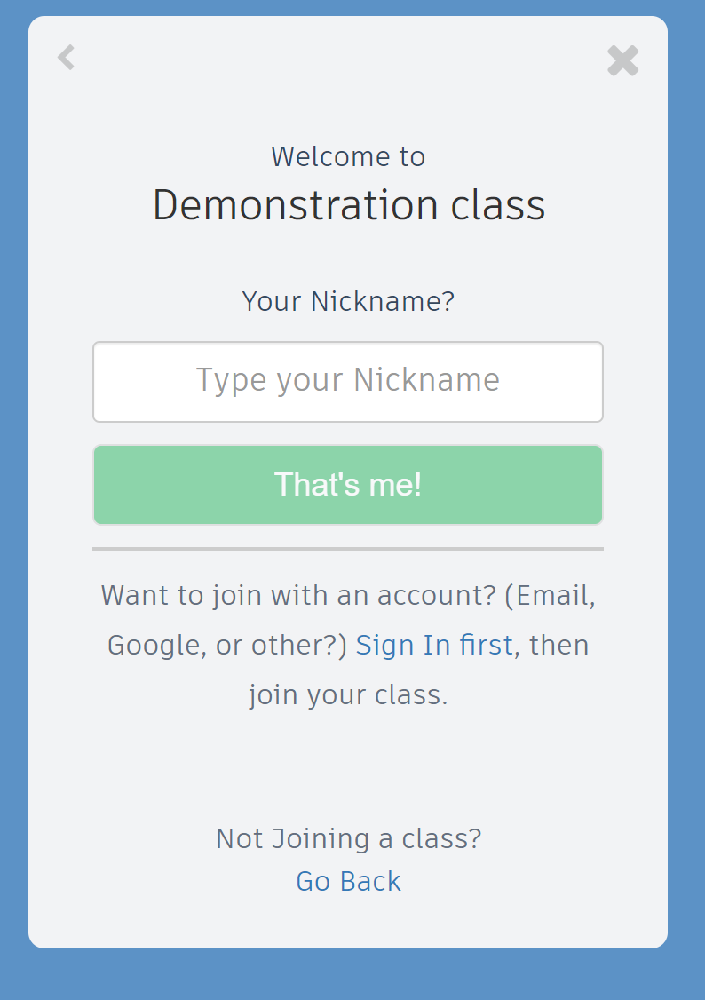
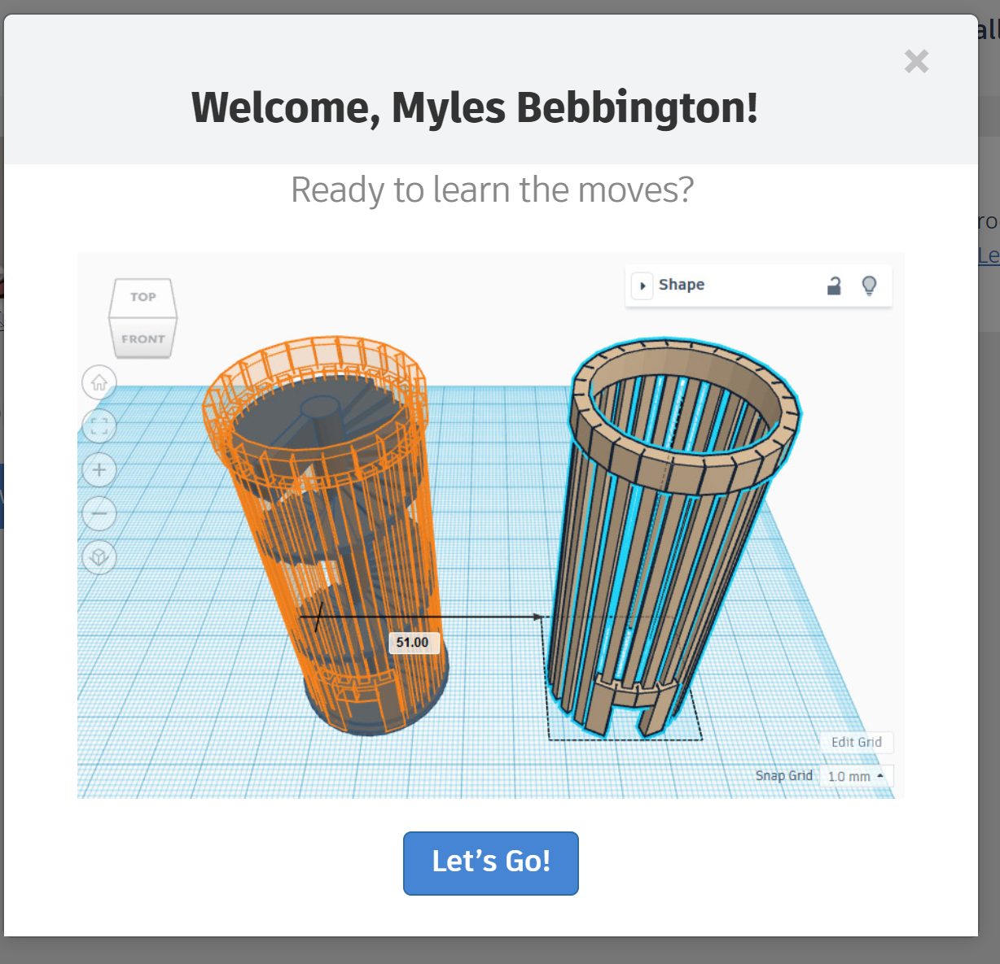

# CAD (Computer Aided Design)
## TinkerCAD
In this unit, you will be learning the fundamentals of 3d Design by creating several items related to your topic. 
You will save and submit these files on your TinkerCAD account. You need to complete the Mayan Temple and then you will have the choice to perfect your temple, or have fun designing a mayan mask and complete the extra challenges.

## Mayan Temple

This is going to be your main project in this unit. You will produce a temple that will be 3d printed for you to keep.

First you will need to sign into TinkerCAD by joining your online classroom.
Open up **Google Chrome** and type in tinkercad . com 

Click the **sign in** button and **select student**. 
Enter the **class code** that your teacher gives you.
You will see this menu.

Type in the nickname that your teacher has assigned you.

In this first lesson, you will work through the self guided tutorials on TinkerCAD that will show you how to use it's functions.

Click on the Let's go button.

In the top right corner, you will see the the **Learn** tab. Select that.

Now work through the **starter** activities. 
If you finish **all** these, work through some of the **Lesson** activities as well.

